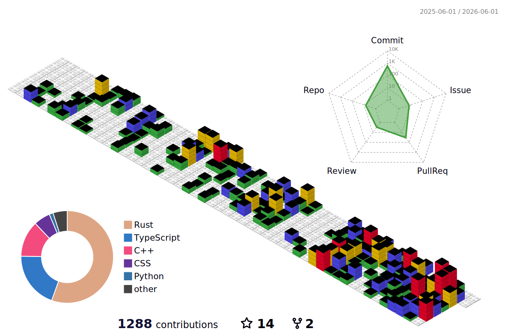

👋 Hey there! I'm Leo Jia (@yuanzui_cf)

🏫 I'm a undergraduate student

👀 I love 🦀 Rust & TypeScript

🌱 I'm diving into Rust, Golang, Dart (Flutter framework), TypeScript, C++ and so on

🎮 When I'm not coding, you'll find me gaming - Counter-Strike 2, Garry's Mod, and Minecraft are my go-to. If I'm free, we could team up!

📫 Feel free to hit me up via email at <a href="mailto:im.leojia@gmail.com">im.leojia@gmail.com</a> or on <a href="https://t.me/kami_madoka">Telegram</a>

---

|  |  |
| ------------- | ------------- |

<picture>
  <source media="(prefers-color-scheme: dark)" srcset="profile-3d-contrib/profile-night-green.svg">
  
</picture>
